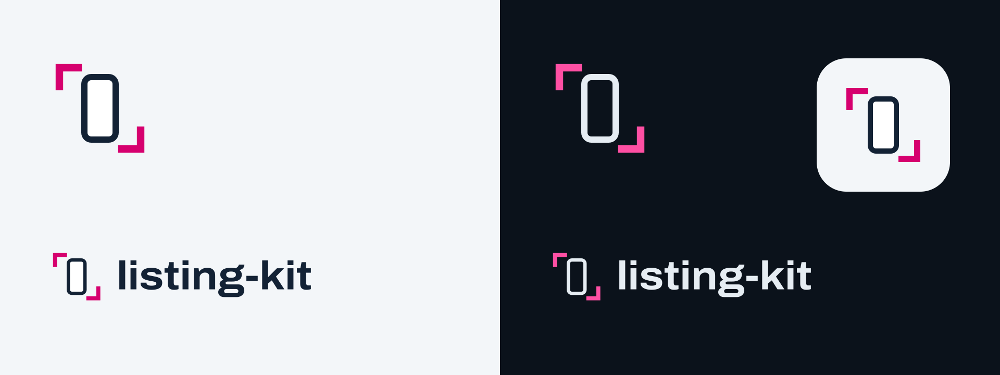

# listing-kit brand kit

A phone screen between two crop marks: listing-kit frames your app for the store.

<picture>
  <source media="(prefers-color-scheme: dark)" srcset="svg/horizontal-on-dark.svg">
  
</picture>



## Pick an asset

| Need | Use |
| --- | --- |
| Main logo | `svg/horizontal-on-light.svg` or `svg/horizontal-on-dark.svg` |
| Symbol alone | `svg/mark-*.svg`: on light, on dark, black, white |
| Transparent PNG logos | `png/`: `@1x` is 128px high, `@2x` 256px |
| App icon | `icons/icon-rounded-1024.png` (square and SVG versions beside it) |
| Website icons | `web/`: SVG favicon, 180px touch icon, 16 to 512px PNGs |

## Colour and type

| Role | Value | Use |
| --- | --- | --- |
| Ink | `#132235` | screen outline and wordmark, on light |
| Proof magenta | `#D6006F` | crop marks, on light |
| Proof magenta (dark) | `#FF4FA3` | crop marks, on dark |
| Fog | `#E6EDF3` | screen outline and wordmark, on dark |
| Night | `#0B121B` | dark backgrounds |
| Table | `#F3F6F9` | light backgrounds, app icon tile |

Type is [Archivo](https://github.com/Omnibus-Type/Archivo) (SIL Open Font License 1.1):
the wordmark is Bold at width 112, headlines on the website go wider. The logos
use outlines, so no font ships with them.

Magenta is for the crop marks, never for the screen or the wordmark, and the
crop marks always sit top-left and bottom-right.

## Use

- Keep clear space of at least one crop-mark arm around the mark.
- Don't stretch, rotate or recolour parts of it, or move the crop marks.
- Use on-light logos on light backgrounds and on-dark logos on dark ones.

## Regenerate

```sh
python3 brand/tools/build.py
```

Needs `fontTools` (`pip install fonttools`) and `rsvg-convert` (`brew install
librsvg`). The mark's geometry and the colours live at the top of
`tools/build.py`, and every file here is written from it. The script downloads
Archivo once from [google/fonts](https://github.com/google/fonts) at a pinned
commit and caches it in `tools/.cache/` (git-ignored). Change the brand there,
not in the generated files. The website at
[listing-kit.bilal.sh](https://listing-kit.bilal.sh) copies its icons from here.
